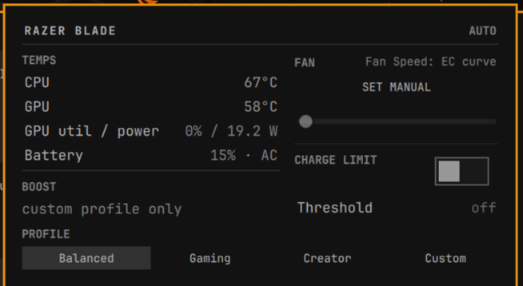

# Razer Blade — Omarchy plugin

Bar widget and dropdown panel for **Razer Blade EC control** in the Omarchy
shell: fan speed (auto or manual RPM), power profiles, CPU/GPU boost,
battery charge limit, and live temps.

Native Omarchy design language — theme-aware, uses `PanelSectionHeader`,
`ToggleSwitch` and the shell's style tokens.



## Install

```bash
omarchy plugin add https://github.com/NerdyViking/omarchy-razer-blade.git --enable
```

Adds the widget to the bar (right section by default; move it later with
`omarchy bar move nerdyviking.razer-blade --section <left|center|right>`).

## Backend (required)

This widget cannot touch the EC by itself — every control goes through a
root-owned daemon, both for safety and because the EC is owned by a
userspace driver. Install the backend first:

1. **razer-control-revived** — userspace HID driver for the Razer EC, from
   [its releases](https://github.com/encomjp/razer-control-revived). Your
   USB PID must be listed (`lsusb | grep -i razer`, `1532:xxxx`).
2. **razer-blade** — daemon + `razer-ctl` CLI, from
   [https://github.com/NerdyViking/razer-blade.git](https://github.com/NerdyViking/razer-blade):

   ```bash
   git clone https://github.com/NerdyViking/razer-blade.git && cd razer-blade && git checkout --detach 293e03babf7f75466a8e2f422dd05c972e34cd0c && cargo build --release && sudo ./scripts/install.sh && sudo systemctl enable --now razer-blade-daemon
   ```
   (Pinned to a full commit so the build always uses the reviewed revision.)
3. **NVIDIA driver** — optional but recommended: live dGPU temps/util/power
   come from NVML (`nvidia-utils` or `nvidia-open`).

Until `razer-ctl` shows up on PATH, the bar widget displays **SETUP** and
the panel opens a guided install. Press **CHECK AGAIN** after install —
the panel switches to the controls (no shell restart).

## Usage

- **Bar**: GPU temp, fan-mode indicator (`+` when manual).
- **FAN**: SET TO AUTO, plus MIN / BALANCED / MAX (clamped EC range).
  Manual presets are a session: the widget re-sends the RPM so the daemon
  watchdog does not revert after 30s. Header shows remaining lease seconds.
- **PROFILE**: Balanced / Gaming / Creator / Custom.
- **BOOST**: CPU/GPU boost cycle (Custom profile only).
- **CHARGE LIMIT**: on/off + threshold cycle.

## Privilege boundary

The widget runs unprivileged inside `omarchy-shell`. It only talks to
`razer-ctl`, which relays commands to `razer-blade-daemon` (root). The
daemon clamps fan RPM, verifies writes by readback, reverts to auto on a
watchdog timeout and at boot — see `docs/safety.md` in the backend repo.

## Remove

```bash
omarchy plugin remove nerdyviking.razer-blade
```

## License

GPL-2.0-or-later. See [LICENSE](LICENSE).
